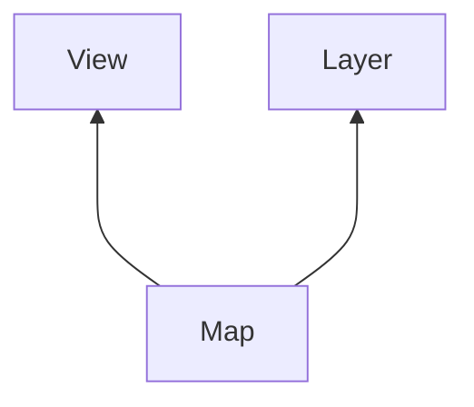

# KWS2100-GIS

- A Map object needs a View to [control](https://openlayers.org/en/latest/apidoc/module-ol_View-View.html) how to  display the map.
- A Layer provides geospatial data that is [vector](https://gisgeography.com/spatial-data-types-vector-raster/) or [raster](https://desktop.arcgis.com/en/arcmap/latest/manage-data/raster-and-images/what-is-raster-data.htm) information.
  - Vectors are polygons i.e. used for boundaries and borders.
  - Raster are cells/tiles i.e. used for projections, Google Maps projection into tiles.

